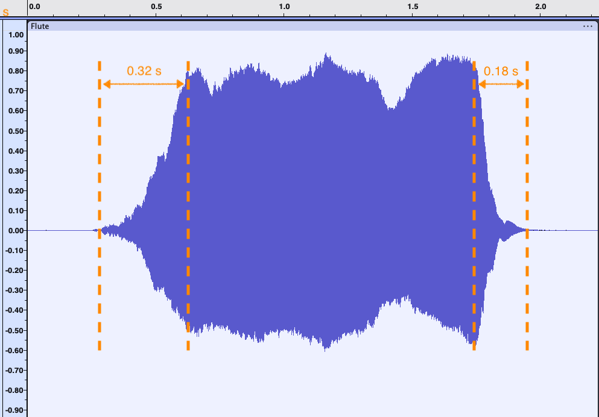
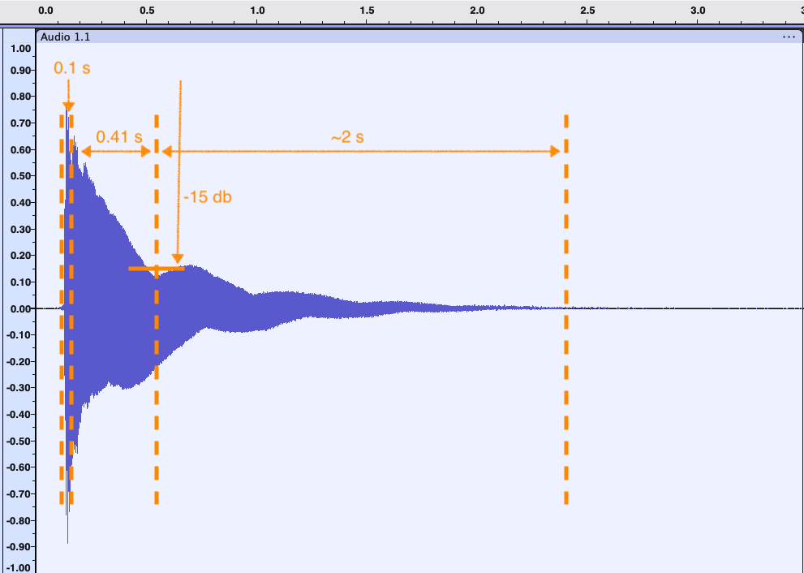
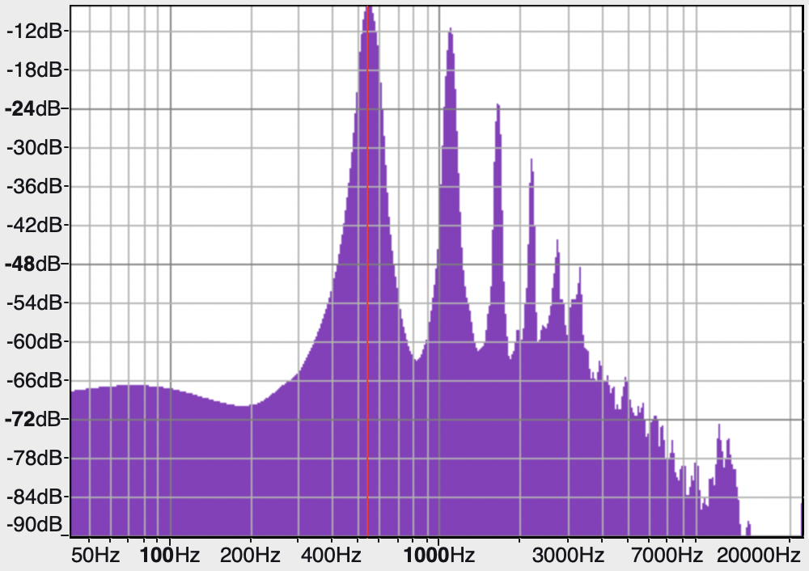
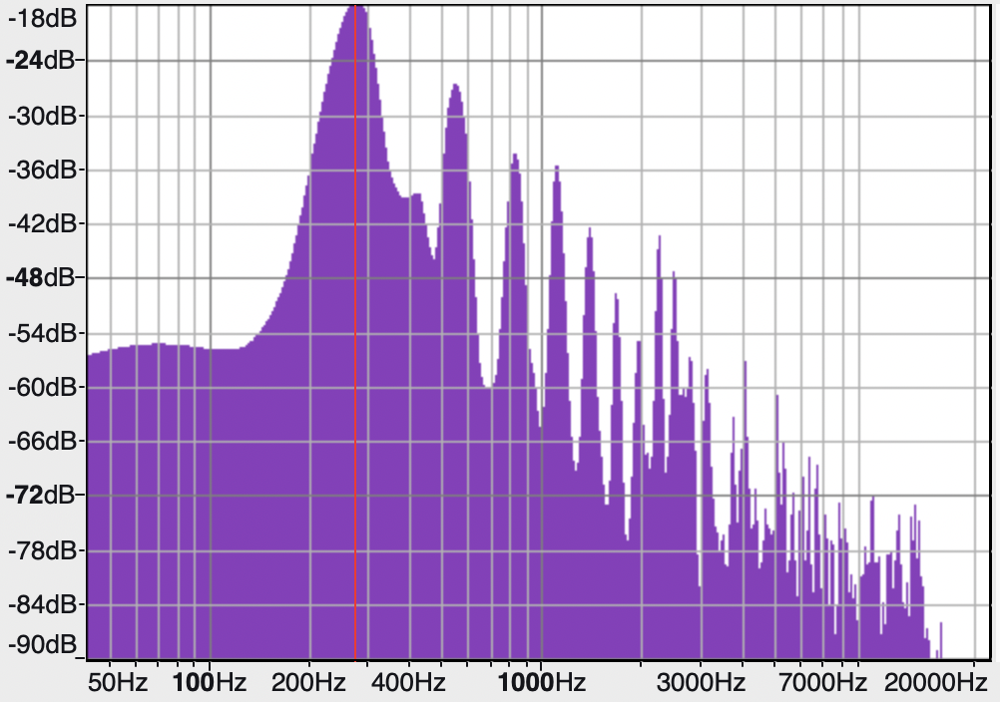

# Instruments

An instrument is a Tuun expression that produces a waveform. A common type of instrument is one that takes a duration and a frequency as arguments. The specified frequency is the *fundamental* frequency of the note to be played: the frequency upon which any harmonics and other overtones (if any) is based.

<div class="container">
  <tuun-synth description="A very simple instrument" open='["std"]' expanded>
    let
      inst = fn(dur, freq_hz) => 
        $freq_hz
        | fin(time - dur)
    in
      // 1.75 seconds, middle C
      inst(1.75, 261.63)
  </tuun-synth>
</div>

This is obviously one of the most primitive instruments possible, having only a single frequency and no variation to speak of. This document walks through a number of methods for developing instruments that build from this minimal example. For the instruments below, we'll often use the sounds of real, physical instruments as guides, but you can also use these techniques to experiment with novel sounds.

There are also other ways of defining what it means to be an "instrument." See [MIDI instruments](#midi-instruments) below for another example.

<!-- move down?
If the waveform is finite and [sequenced](tuun-langs.md#sequencing) then then instrument can be used to play a series of notes.


When developing an instrument it can often be useful to hear several notes played on the instrument. Even if we are not handling MIDI events, we can still use MIDI note numbers as a convenient way of specifying each fundamental frequency. Here's an example of a simple instrument playing the first five notes of a C major scale.

<div class="container">
  <tuun-synth description="Five notes played on a simple instrument" open='["std"]' expanded>
    <script type="text/tuun">
      let
        inst = fn(dur, freq_hz) =>
          $freq_hz
          | fin(time - dur)
          | seq(time - dur)
      in
        <map(fn (note) => inst(H, @note), [60, 62, 64, 65, 67])>
    </script>
  </tuun-synth>
</div>
-->
<!-- 
It can also be useful to hear the same note repeated, while one or more parameters of the instrument are adjusted in real time. The following example adds vibrato to that same simple instrument.

<div class="container">
  <tuun-synth description="An instrument with vibrato played every two seconds"
      sliders='["vibrato_rate:6:2:10"]' open='["std"]' expanded>
    <script type="text/tuun">
      let
        inst = fn(dur, freq_hz) => 
          sine(2 * pi * freq_hz, pow(2, 1/24) * $vibrato_rate)
          | fin(time - dur)
          | seq(time - dur)
      in
        reset($(1/2), inst(H, @60) | unseq())
    </script>
  </tuun-synth>
</div>
(Note that when used with `reset`, the waveform must be un-sequenced.)

We'll use both of presentations to explore instruments as we develop them below.
 -->
### Tools

When trying to duplicate the sound of an existing instrument, it's helpful to use a tool to analyze samples of that instrument. The visualizations and analysis below were performed with [Audacity](https://www.audacityteam.org/), a free and open source audio application.

## Amplitude envelope

One of the most important aspects of developing an instrument is determining its *amplitude envelope*. The envelope controls how the loudness of a note changes over time. For example, sounds produced by wind instruments take time before they reach their full volume, even if that's only a fraction of a second. In contrast, many percussion instruments reach their full volume almost immediately.

Though instruments can have envelopes with arbitrary shapes, most physical synthesizers (and their digital counterparts) use a small, fixed set of parameters. Tuun offers several libraries that provide common parameter sets.

One of the most common envelope shapes is called "ADSR" which is defined by the following parameters:

<!-- cSpell:disable -->
* **A**ttack (duration) - the length of time it takes the waveform to reach its initial peak in amplitude
* **D**ecay (duration) - the length of time it takes a waveform to fall from that peak to its sustain level
* **S**ustain (level) - the level of the sustain period, in relation to the initial peak
* **R**elease (duration) - the length of time it takes a waveform to fall from its sustain level to (near) silence
<!-- cSpell:enable -->

<!-- TODO insert graphic -->

The sustain also has a duration, but often this is determined by the overall length of the waveform.

Below are two samples from live instruments, along with plots of their amplitude envelopes over time and the measured values of ADSR.

| | Flute                      | Ukulele |
| -- | ---------------            | ------  |
| sample | <audio controls><source src="flute.wav" type="audio/wav">Your browser does not support the audio element.</audio> | <audio controls><source src="ukulele.wav" type="audio/wav">Your browser does not support the audio element.</audio> |
| waveform |  | 
| attack   | 0.32 s | 0.01 s         | 
| decay    | n/a    | 0.41 s         | 
| sustain  | 0.0 db | ~15 db         |
|  
| release  | 0.18 s | ~2 s           |

In this sample, the flute has relatively long attack but no decay: it's sustain level is the same as its initial peak. The ukulele, on the other hand, has a sharp attack and a moderately long decay followed by a very long release.

 Of course, a real instrument doesn't have exactly *one* envelope: performers can exert some control over the envelope by, for example, changing the sharpness of their breadth. In this discussion, however, we'll assume that an instrument has a single envelope.

Since we're trying to match the sound of these particular samples, we'll use the measured fundamental frequency (546 Hz) instead of the closest standard note (C#5).

The example below is configured with an envelope that matches the flute sample. See if you can adjust the sliders to get the instrument to more closely resemble the ukulele sample above. (This example uses `reset` to repeat a note every three seconds so you can easily hear the changes to the envelope.)

<div class="container">
  <tuun-synth open='["std"]' sliders='["attack_dur:0.32:0.0:1.0","decay_dur:0.0:0.0:1.0","sustain_level_db:0.0:-36.0:2.0","release_dur:0.18:0.0:2.0"]'>
    <script type="text/tuun">
      let
        inst = fn(dur, freq_hz) => let
          sustain_dur = dur - attack_dur - release_dur,
        in
          $freq_hz
          | ADSR(attack_dur, decay_dur, db2amp(sustain_level_db), sustain_dur, release_dur)
      in
        reset($(1/3), inst(1.75, 546))
    </script>
  </tuun-synth>
</div>

## Overtones

Besides for the amplitude envelope, the overtones are one of the more important aspects that define the timbre (or character) of a note. Below are the spectra from the two samples above:

| | Flute                      | Ukulele |
| -- | ---------------            | ------  |
| spectrum |  | 


### Additive synthesis


Since [flutes are open at both ends](https://newt.phys.unsw.edu.au/jw/fluteacoustics.html), they produce all of the harmonics (not just the odd ones). In this sample, the fundamental and the next five harmonics are most clearly audible.

<div class="container">
  <tuun-synth description="Flute using additive synthesis" open='["std"]' sliders='["fundamental_db:-8.1:-60:6","second_harmonic_db:-11.6:-60:6","third_harmonic_db:-22.9:-60:6","fourth_harmonic_db:-31.7:-60:6","fifth_harmonic_db:-44.1:-60:6","sixth_harmonic_db:-47.8:-60:6"]'>
    <script type="text/tuun">
      let
        flute = fn(dur, freq_hz) => let
          attack_dur = 0.27,
          release_dur = 0.17,
          sustain_dur = dur - attack_dur - release_dur,

          level_dbs = [
            fundamental_db,
            second_harmonic_db,
            third_harmonic_db,
            fourth_harmonic_db,
            fifth_harmonic_db,
            sixth_harmonic_db
          ],
          level_amps = map(db2amp, level_dbs),
          level_amps = normalize(1.0)(level_amps),

          orders = unfold(fn(order) => order + 1, 1, len(level_amps)),
          freq_hzs = map(fn(order) => freq_hz * order, orders),
          make_component = fn(freq_hz, level_amp) => $freq_hz * level_amp,
        in
          {map(make_component, zip(freq_hzs, level_amps))}
          | ADSR(attack_dur, 0.0, 1.0, sustain_dur, release_dur)
      in
        reset($(1/3), flute(1.75, 546))
    </script>
  </tuun-synth>
</div>


### Subtractive synthesis

Subtractive synthesis was a popular technique used in many analog synthesizers in the 1970s and 1980s. Instead of building up a complex sound by adding additional frequencies (as in additive synthesis), subtractive synthesis starts with a waveform rich in overtones and then removes 

<!-- Welsh's Synthesizer Cookbook -->

The ukulele sample has a rich set of overtones.


<!-- 
#### Oscillator types

#### Filters

The flute sample can also be synthesized using subtractive synthesis. 

<div class="container">
  <tuun-synth open='["std"]' sliders='["lpf_cutoff:2000:200:10000"]'>
    <script type="text/tuun">
      let
        flute = fn(dur, freq_hz) => let
          attack_dur = 0.27,
          release_dur = 0.17,
          sustain_dur = dur - attack_dur - release_dur,
        in
          $freq_hz
          | lpf(0.5, lpf_cutoff)
          | ADSR(attack_dur, 0.0, 1.0, sustain_dur, release_dur)
      in
        reset($(1/3), flute(1.75, 546))
    </script>
  </tuun-synth>
</div>


### Pulse width modulation

 -->
### Frequency and phase modulation

Frequency modulation (FM) and phase modulation (PM) are two related techniques for using a combination of sine waves to create rich tones. See [advanced synthesis using sine](sine.md#advanced-synthesis) for more details.

As noted above, the ukulele sample has a rich set of harmonic overtones, especially for the first part of the sample.

<div class="container">
  <tuun-synth description="PM-based ukulele" open='["std"]' >
    <script type="text/tuun">
      let
        inst = fn(dur, freq_hz) =>
          let
            I = 6,
            D = 1,
            fc = freq_hz,
            fm = D/2 * freq_hz
            //env = 
          in
            sine(2*pi * fc, I * sine(2*pi * fc, 0))
      in
        inst(W, 546)
    </script>
  </tuun-synth>
</div>


Another example of a instrument that uses PM is a 1980s-style electric piano. Popularized by synthesizers such as the Yamaha DX7, this electric piano uses a combination of multiple phase modulated sine waves: the first to create the sustained vibrations of the strings, while the second is used to create the sharp, tinny sound of the hammer striking the string.

<div class="container">
  <tuun-synth description="Electric piano" open='["std"]' >
    <script type="text/tuun">
      let
        inst = fn(dur, freq_hz) =>
          let
            I = 6,
            D = 1,
            fc = freq_hz
          in
            sine(2*pi * fc, I * sine(2*pi * fc, 0))
      in
        inst(H, 546)
    </script>
  </tuun-synth>
</div>


<!-- 

## Low-frequency modulation

## Filters

### Filter envelopes

## Secondary oscillators  

### Octaves and de-tuning

### Synchronization

## Noise
 -->


## MIDI instruments

By a "MIDI instrument," we mean an instrument that can be used to respond to MIDI "note-on" and "note-off" events. This sort of instrument differs from the ones described above in two important ways.

1. Their duration is not known in advance: the performer will determine when the note will end (or at least may determine if and when a note will end early).
1. They are not meant to be sequenced using `\` or `<...>`. Instead, the performer will determine when the following note begins.

As such, in most cases, it doesn't make sense to use `fin` or `seq` in the definition of these instruments.

<!-- when to use fin -->

MIDI instruments are defined by a function that returns a *pair* of waveforms. The first waveform is used to respond to a note-on event. The second waveform is used to respond to a note-off event as a "terminating" waveform. As discussed in the [handling of MIDI events](dynamic.md#midi-note-on-and-note-off), the terminating waveform should be finite and end with a sample of 0.0 (or nearly 0.0).

```
fn(key, velocity) => 
  let
    note_on = ...
    note_off = Rw(release_dur, 1.0)
  in
    (note_on, note_off)
```


<script type="module" src="tuun/tuun-synth.js"></script>
